# Monday PDF sample audit
Seed 20250420, 48 samples

| id | page | track | sub | arr | dep | arr_t | dep_t | veh | color | cont_prev/next | crop |
|---:|---:|---:|---:|:---:|:---:|:---:|:---:|---:|:---|:---:|:---|
| 388 | 8 | 6 | 1 | – | 164 | 22:00 | – | 1 | `0.000,1.000,1.000` | → |  |
| 397 | 8 | 9 | 2 | 3689 | 3602 | 23:40 | – | 1 | `0.800,0.600,1.000` | → |  |
| 410 | 8 | 16 | 3 | 3088 | 3021 | 22:48 | – | 1 | `0.733,0.710,0.616` | → |  |
| 404 | 8 | 11 | 2 | – | 481 | 23:59 | – | 1 | `0.000,1.000,1.000` | → |  |
| 13 | 1 | 8 | 2 | 2047 | 2012 | 00:03 | 05:35 | 1 | `0.984,0.769,0.192` | ← | 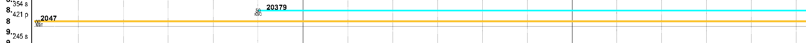 |
| 302 | 6 | 15 | 2 | 3064 | 3119 | 16:48 | 17:01 | 2 | `0.733,0.710,0.616` | – | 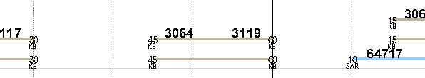 |
| 254 | 6 | 7 | 1 | 3265 | 13224 | 18:06 | 18:26 | 2 | `1.000,0.600,0.800` | – | 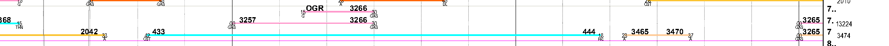 |
| 299 | 6 | 15 | 1 | 3066 | 3121 | 17:19 | 17:32 | 2 | `0.733,0.710,0.616` | – | 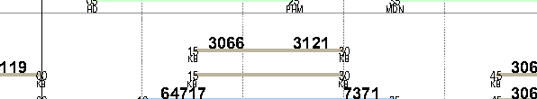 |
| 51 | 3 | 3 | 1 | – | 426 | 06:33 | 08:20 | 2 | `0.000,1.000,1.000` | – | 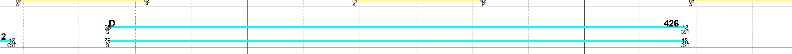 |
| 104 | 3 | 14 | 1 | 20156 | 11055 | 07:38 | 07:55 | 2 | `0.800,1.000,0.800` | – | 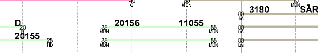 |
| 316 | 7 | 1 | 3 | – | – | 19:38 | 19:59 | 1 | `1.000,0.949,0.584` | – | 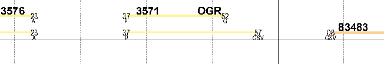 |
| 108 | 3 | 14 | 2 | – | – | 08:02 | 08:18 | 1 | `0.733,0.710,0.616` | – |  |
| 328 | 7 | 6 | 1 | – | – | 19:00 | 19:20 | 1 | `1.000,0.600,0.800` | – | 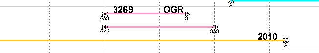 |
| 120 | 3 | 16 | 2 | 3178 | 3031 | 07:32 | 07:45 | 2 | `0.733,0.710,0.616` | – | 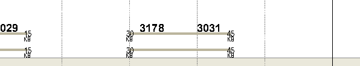 |
| 266 | 6 | 9 | 2 | 3665 | 13618 | 17:28 | 17:40 | 1 | `0.800,0.600,1.000` | – |  |
| 262 | 6 | 9 | 1 | – | 3262 | 15:13 | 15:27 | 2 | `1.000,0.600,0.800` | – | 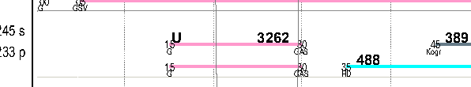 |
| 407 | 8 | 13 | 2 | 3084 | 3091 | 21:45 | 22:45 | 1 | `0.733,0.710,0.616` | – |  |
| 382 | 8 | 3 | 2 | 447 | – | 22:45 | 23:28 | 1 | `0.000,1.000,1.000` | – | 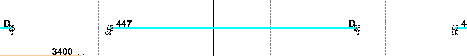 |
| 366 | 7 | 14 | 2 | 11098 | 11159 | 20:09 | 20:58 | 1 | `0.800,1.000,0.800` | – | 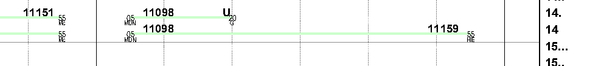 |
| 184 | 5 | 4 | 2 | 427 | 438 | 12:42 | 14:20 | 1 | `0.000,1.000,1.000` | – | 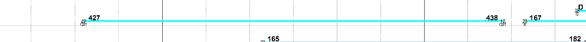 |
| 300 | 6 | 15 | 2 | 3058 | 3113 | 15:14 | 15:27 | 1 | `0.733,0.710,0.616` | – | 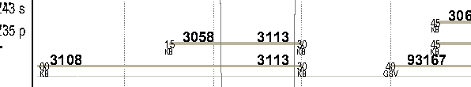 |
| 215 | 5 | 12 | 2 | 13156 | 13161 | 14:56 | 15:07 | 1 | `0.733,0.710,0.616` | – | 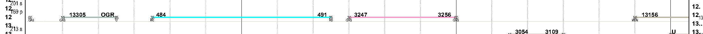 |
| 361 | 7 | 14 | 1 | 20178 | 11143 | 18:35 | 18:53 | 2 | `0.800,1.000,0.800` | – | 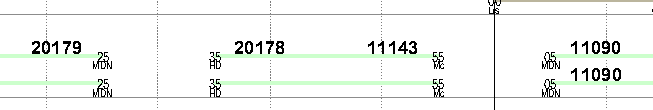 |
| 247 | 6 | 4 | 1 | 435 | – | 16:45 | 17:23 | 1 | `0.000,1.000,1.000` | – | 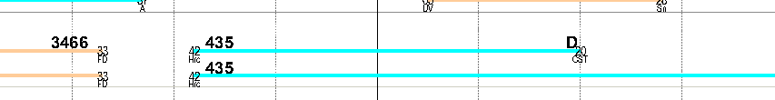 |
| 83 | 3 | 11 | 2 | 3219 | 3228 | 06:30 | 06:58 | 1 | `1.000,0.600,0.800` | – | 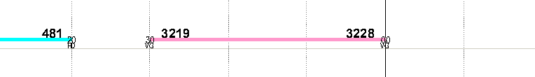 |
| 261 | 6 | 8 | 2 | 391 | 394 | 17:45 | 18:06 | 1 | `0.396,0.478,0.529` | – | 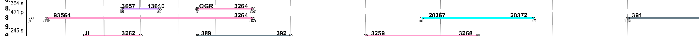 |
| 228 | 5 | 15 | 3 | 3052 | 3107 | 13:48 | 14:01 | 1 | `0.733,0.710,0.616` | – | 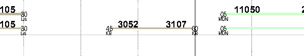 |
| 84 | 3 | 11 | 2 | 7330 | – | 08:14 | 08:28 | 1 | `0.600,0.800,1.000` | – | 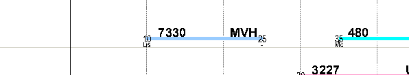 |
| 372 | 7 | 16 | 3 | 3072 | – | 18:45 | 19:05 | 1 | `0.733,0.710,0.616` | – | 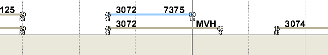 |
| 174 | 4 | 16 | 3 | 3042 | 3047 | 11:19 | 11:48 | 1 | `0.733,0.710,0.616` | – |  |
| 109 | 3 | 15 | 1 | 3024 | 3179 | 06:45 | 06:58 | 2 | `0.733,0.710,0.616` | – | 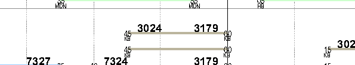 |
| 393 | 8 | 8 | 2 | 3481 | 17384 | 21:23 | 21:47 | 1 | `1.000,0.600,0.800` | – | 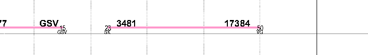 |
| 162 | 4 | 13 | 2 | – | 3043 | 10:31 | 10:45 | 1 | `0.733,0.710,0.616` | – | 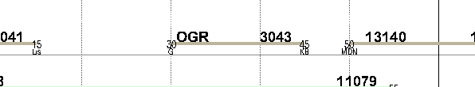 |
| 42 | 2 | 16 | 1 | – | 3025 | 06:07 | – | 2 | `0.733,0.710,0.616` | → |  |
| 79 | 3 | 10 | 2 | 3627 | 13680 | 07:57 | 08:09 | 1 | `0.800,0.600,1.000` | – | 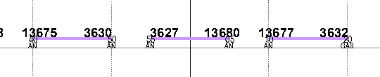 |
| 140 | 4 | 8 | 1 | 13681 | – | 09:14 | 09:28 | 1 | `0.800,0.600,1.000` | – | 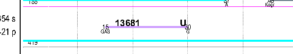 |
| 81 | 3 | 10 | 2 | 3629 | – | 08:30 | 08:44 | 1 | `0.800,0.600,1.000` | – | 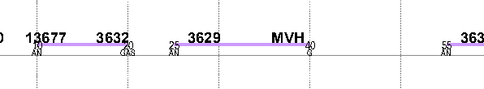 |
| 389 | 8 | 6 | 2 | – | 3486 | 21:20 | 21:34 | 1 | `1.000,0.800,0.600` | – | 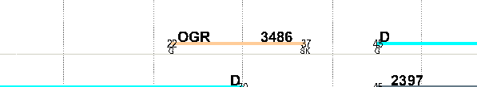 |
| 150 | 4 | 10 | 2 | 3637 | 3642 | 10:27 | 10:50 | 1 | `0.800,0.600,1.000` | – | 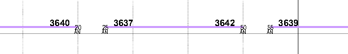 |
| 146 | 4 | 9 | 2 | 3237 | 3246 | 11:04 | 11:32 | 1 | `1.000,0.600,0.800` | – | 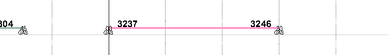 |
| 149 | 4 | 10 | 2 | 3635 | 3640 | 09:56 | 10:19 | 1 | `0.800,0.600,1.000` | – | 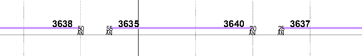 |
| 30 | 2 | 7 | 1 | 3215 | 3224 | 05:35 | 06:03 | 1 | `1.000,0.600,0.800` | – |  |
| 323 | 7 | 4 | 1 | 175 | 192 | 18:22 | 19:37 | 2 | `0.000,1.000,1.000` | – |  |
| 179 | 5 | 2 | 3 | 3549 | 3554 | 13:21 | 13:42 | 1 | `1.000,0.949,0.584` | – |  |
| 4 | 1 | 2 | 3 | 17399 | 3220 | 00:09 | 05:01 | 1 | `1.000,0.600,0.800` | – | 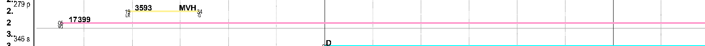 |
| 91 | 3 | 13 | 1 | 13273 | 7331 | 07:17 | 07:35 | 1 | `0.600,0.800,1.000` | – | 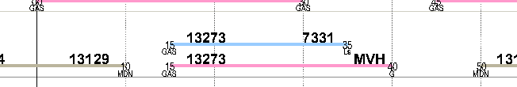 |
| 273 | 6 | 10 | 2 | 3663 | 13616 | 16:57 | 17:09 | 1 | `0.800,0.600,1.000` | – | 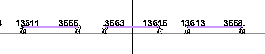 |
| 60 | 3 | 6 | 2 | – | 13734 | 08:33 | 08:47 | 1 | `1.000,0.600,0.800` | – | 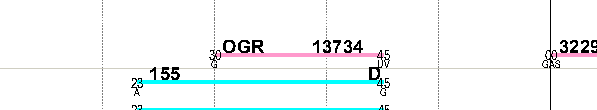 |
